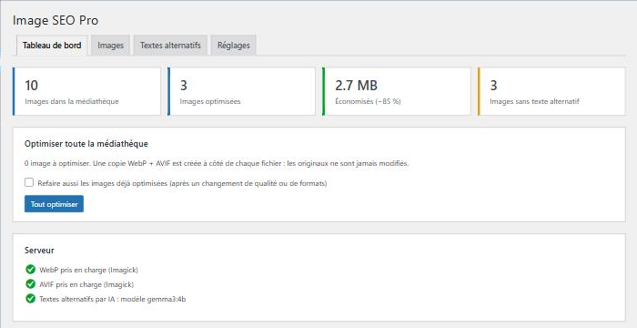
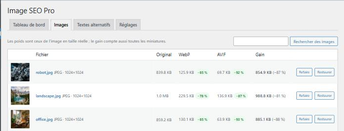
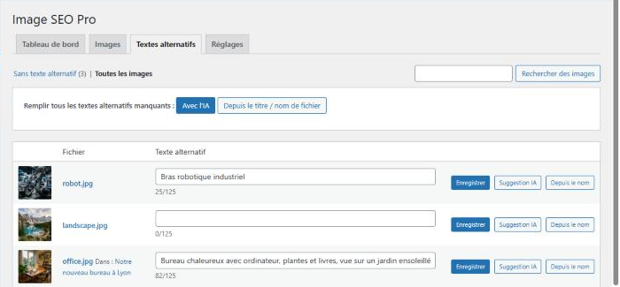

# Image SEO Pro

Plugin WordPress qui allège les images et complète les textes alternatifs. Chaque image reçoit une
copie **WebP** et **AVIF** créée à côté de l'original, sans jamais le modifier. Les textes alternatifs
manquants se remplissent avec une **IA de vision** (Ollama en local, ou une API compatible OpenAI) ou à partir
du nom des fichiers.


[](https://github.com/dyzlek/image-seo-pro/actions/workflows/tests.yml)

## Fonctionnalités

- **Copies WebP / AVIF sans risque** : `photo-300x200.jpg` → `photo-300x200.jpg.webp` et `.avif`, pour
  l'image principale et chaque miniature. Les originaux ne sont **jamais** modifiés ni supprimés. Une copie
  plus lourde que l'original n'est pas gardée. Les PNG gardent leur transparence et le profil couleur est
  conservé.
- **Imagick ou GD**, choisi automatiquement selon ce que le serveur sait faire, avec repli sur GD si Imagick
  échoue.
- **Automatique à l'envoi**, ou **en masse** depuis le tableau de bord, avec barre de progression et bouton
  d'arrêt. Une image peut aussi être traitée seule, refaite ou restaurée.
- **Affichage sur le site** : balise `<picture>`, où chaque navigateur prend le meilleur format qu'il
  comprend (AVIF, puis WebP, puis l'original). Ça couvre les contenus (articles, pages, blocs) **et** les
  images du thème (images mises en avant, galeries). Avec `display: contents`, la mise en page du thème ne
  bouge pas. Autre mode possible : remplacer directement l'URL par le WebP.
- **Textes alternatifs** : liste des images sans alt, édition en ligne avec compteur (125 caractères
  conseillés), suggestion par IA ou à partir du titre / nom de fichier, et remplissage en masse.
  - Les noms inutiles comme `IMG_20240101_1234` ou « Capture d'écran… » sont ignorés.
  - L'IA reçoit une miniature d'environ 1024 px, pas l'original de plusieurs Mo. Elle écrit dans la langue
    du site et peut recevoir le titre de la page où l'image est utilisée.
- **Alt vides dans les articles déjà publiés** : complétés à l'affichage avec le texte de la médiathèque,
  sans modifier les articles.
- **Chargement différé** : nombre d'images du haut de page chargées tout de suite, réglable (utilise le
  mécanisme natif de WordPress).
- **WP-CLI** : `wp isp optimize`, `wp isp restore`, `wp isp stats`, `wp isp alt --source=ai`.
- **Propre** :
  - Les copies sont supprimées en même temps que le média.
  - La désinstallation retire copies, métadonnées et réglages, mais garde les originaux et les textes
    alternatifs.
  - Les réglages de la version 1.x sont repris.
- **Sécurité** : jeton et vérification des droits sur chaque action (`upload_files`, `edit_post` sur le
  média, `manage_options` pour les réglages), entrées nettoyées, sorties échappées. La clé d'API n'est
  jamais réaffichée.
- Interface native WordPress, utilisable au clavier et sur mobile. Traduction française incluse.

## Captures d'écran

| Tableau de bord | Images |
|---|---|
|  |  |



## Installation

1. Téléchargez `image-seo-pro-vX.Y.Z.zip` depuis les [Releases](https://github.com/dyzlek/image-seo-pro/releases).
2. Dans WordPress : **Extensions → Ajouter → Téléverser une extension**, puis activez-la.
3. Ouvrez **Médias → Image SEO Pro**. L'onglet *Tableau de bord* indique ce que le serveur sait produire
   (WebP, AVIF). Cliquez sur **Tout optimiser** pour traiter les images déjà présentes.

### Textes alternatifs par IA (optionnel)

**Avec Ollama, gratuit et en local :**

```bash
ollama pull gemma3:4b
```

Dans **Réglages**, choisissez le service *Ollama* et l'adresse `http://localhost:11434`
(`http://host.docker.internal:11434` si WordPress tourne dans Docker), puis le modèle `gemma3:4b`. Cliquez
ensuite sur **Tester la connexion**. Tout modèle qui comprend les images convient, par exemple `qwen2.5vl`
ou `llava`.

**Avec une API compatible OpenAI** (OpenAI, Mistral, LM Studio…) : renseignez l'adresse (par exemple
`https://api.openai.com/v1`), le modèle (`gpt-4o-mini`) et la clé d'API.

## Réglages

| Réglage | Par défaut | Rôle |
|---|---|---|
| Formats | WebP | WebP et/ou AVIF. L'AVIF est plus léger mais plus lent à créer. |
| Qualité | 80 % | Entre 75 et 85, c'est un bon compromis. |
| Nouveaux envois | activé | Optimise chaque image à l'envoi. |
| Servir les copies | `<picture>` | `<picture>`, remplacement d'URL par le WebP, ou désactivé. |
| Chargement différé | 3 | Images du haut de page chargées immédiatement (les autres en `loading="lazy"`). |
| Alt vide dans les contenus | médiathèque | Complète un alt vide avec celui de la médiathèque (ou le titre de l'image). |

## WP-CLI

```bash
wp isp optimize                 # toutes les images pas encore optimisées
wp isp optimize 42 43 --force   # refaire des images précises
wp isp restore --all            # supprimer toutes les copies
wp isp stats
wp isp alt --source=ai --dry-run
```

## Pour les développeurs

Filtres disponibles :

- `isp_quality` (int, ID) : qualité pour une image donnée.
- `isp_image_engine` (`auto` | `imagick` | `gd`) : force un moteur de conversion.
- `isp_deliver` (bool) : active ou non la réécriture côté site pour la requête en cours.
- `isp_ai_prompt` (string, ID) : consigne envoyée à l'IA.
- `isp_ai_timeout` (int) : délai des appels à l'IA.

Action : `isp_optimized` (ID, données), déclenchée après chaque optimisation.

### Environnement de test

Le `docker-compose.yml` lance WordPress sur http://localhost:8080, avec ce dossier monté comme plugin :

```bash
docker compose up -d
docker compose run --rm wpcli wp eval-file wp-content/plugins/image-seo-pro/tests/integration/run.php
```

Les tests d'intégration tournent dans un vrai WordPress et couvrent :

- la conversion : formats, transparence, originaux intacts ;
- l'affichage `<picture>` et en mode remplacement d'URL ;
- les textes alternatifs ;
- le client IA, avec des réponses simulées ;
- la sécurité des actions AJAX ;
- la restauration, la suppression et la désinstallation.

`ISP_ENGINE=gd|imagick` force un moteur et `ISP_TEST_UNINSTALL=1` ajoute le test de désinstallation. La
CI GitHub les lance avec GD et avec Imagick, et vérifie la syntaxe de PHP 7.4 à 8.4.

### Publier une version

1. Mettre à jour la version dans `image-seo-pro.php` (en-tête + `ISP_VERSION`), `readme.txt` (`Stable tag`)
   et `CHANGELOG.md`.
2. `git tag vX.Y.Z && git push --tags` : la CI teste, construit le zip et publie la Release.

## Licence

[GPL-2.0-or-later](LICENSE), comme WordPress.
